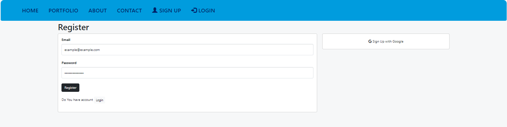

Crypto Wallet is a Web-Application to monitor Crypto currency prices and calculate your long-term profits and losses.  
All you have to do is register an account either via your e-mail or Google and then create your own wallet and enter the buying and selling transactions manually or retrieve them from the platforms through which you made the purchase through your own API in a very easy way, and the system will calculate the profits and losses for each operation and for each currency in general as It calculates the purchase rate and compares it to the current price and return on investment ROI.  The program currently only supports the Binance platform, and we will add other platforms with the next updates.

